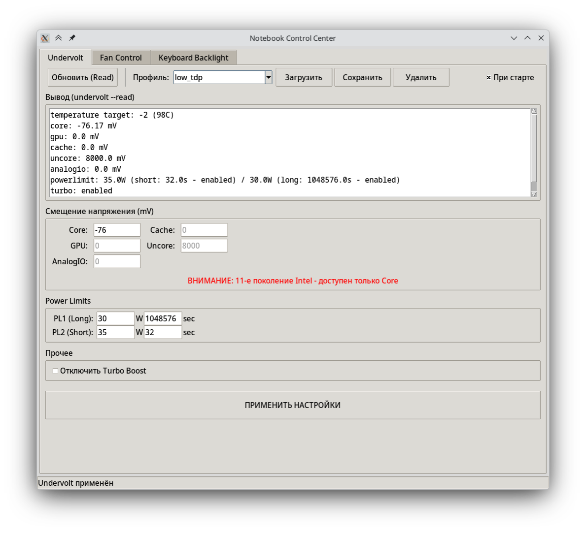
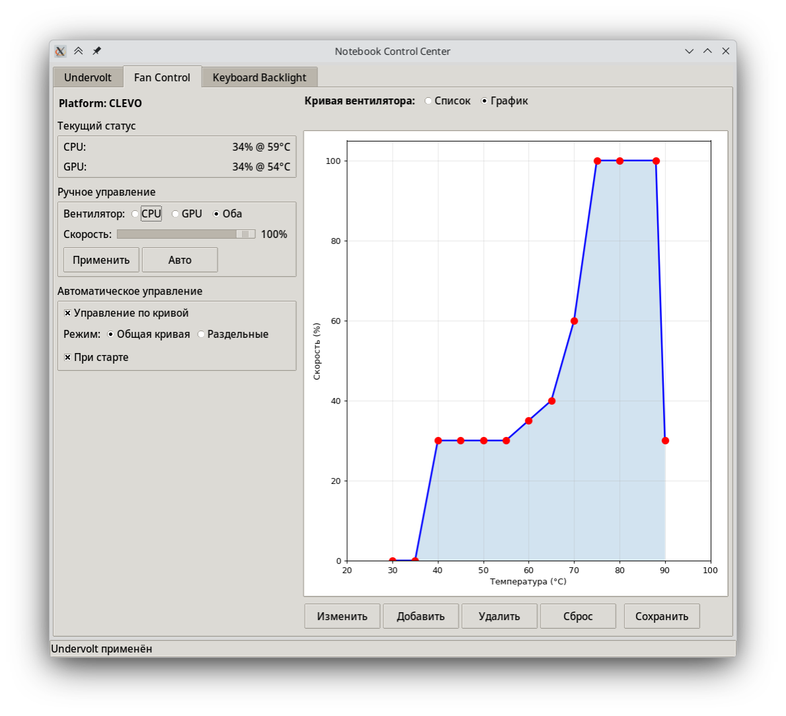
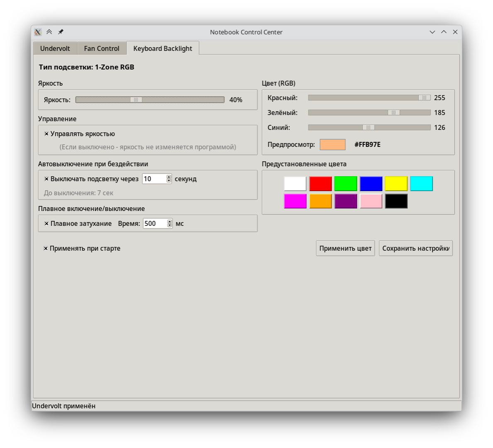

# clevo-n960kx-control-center-slop

Замена TUXEDO Control Center для моего ноутбука

**Зависимости:**  
- [undervolt](https://github.com/p-fpv/undervolt)  
- [clevo-keyboard](https://github.com/p-fpv/clevo-keyboard)  

- Arch:  
sudo pacman -S python-matplotlib python-evdev  
- Debian:  
sudo apt install python3-matplotlib python3-evdev  
*(на debian не проверял)*  

**Картинки:**  
  
  
  
